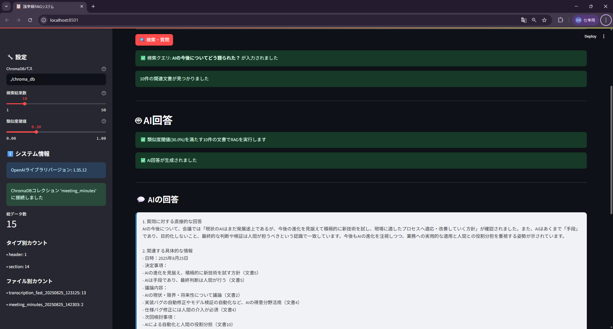

# MP3 → 議事録RAGシステム 完全統合ワークフロー

このワークフローは、MP3ファイルから自動的に議事録を作成し、ChromaDBに保存してRAG（Retrieval-Augmented Generation）システムでAI回答を生成する完全統合システムです。


---
## 🎯 機能概要

1. **MP3ファイルの分割**: 無音箇所を検出して適切な長さに分割
2. **文字起こし**: Faster Whisper + int8量子化を使用して音声をテキストに変換（高速化）
3. **議事録作成**: OpenAI APIを使用して文字起こし結果を構造化された議事録に要約
4. **RAGシステム構築**: 議事録をChromaDBに保存し、ベクトル化して検索可能に
5. **AI回答生成**: Streamlitアプリで自然言語質問に対して議事録ベースの回答を生成
6. **結果統合**: 処理結果のサマリーとファイル管理

---
## 🚀 **統合ワークフロー**

**1つのコマンドで音声からRAG登録まで自動実行！**

```bash
# 完全統合ワークフロー（RAG登録あり）
python mp3_to_minutes_workflow.py your_meeting.mp3

# RAG登録をスキップする場合
python mp3_to_minutes_workflow.py your_meeting.mp3 --no-rag
```

### **自動実行される処理**
1. **MP3分割** → 無音箇所での自動分割
2. **高速文字起こし** → Faster Whisper + int8量子化
3. **議事録作成** → OpenAI APIによる構造化サマリー
4. **RAG登録** → ChromaDBへの自動登録・ベクトル化
5. **結果サマリー** → 処理結果と次のステップ案内

---
## 🔄 個別起動

### **Phase 1: 音声処理**
```bash
# 1. MP3ファイルを分割
python mp3_splitter.py 002_250821V.MP3

# 2. 分割されたWAVファイルを文字起こし
python wav_transcription_faster.py

# 3. 文字起こし結果をサマリー化
python meeting_summarizer.py transcription_20250823_153511.txt
```

### **Phase 2: RAGシステム構築**
```bash
# 4. サマリーをChromaDBに登録
python meeting_rag_processor.py transcription_20250823_153511.md
```

### **Phase 3: AI回答システム**
```bash
# 5. StreamlitアプリでRAG検索・AI回答
streamlit run streamlit_rag_app.py
```

---
## 📋 必要な環境

### 前提条件
- Python 3.8以上
- FFmpeg（音声処理用）
- OpenAI APIキー

### インストール

1. 依存関係のインストール:
```bash
pip install -r requirements.txt
```

2. FFmpegのインストール:
   - Windows: [FFmpeg公式サイト](https://ffmpeg.org/download.html)からダウンロード
   - macOS: `brew install ffmpeg`
   - Ubuntu: `sudo apt install ffmpeg`

3. OpenAI APIキーの設定:
```bash
# Windows
set OPENAI_API_KEY=your_api_key_here

# macOS/Linux
export OPENAI_API_KEY=your_api_key_here

# または.envファイルを作成
echo "OPENAI_API_KEY=your_api_key_here" > .env
```

---
## 🚀 使用方法

### **統合ワークフロー**

```bash
# 1. 音声から議事録・RAG登録まで一気通貫
python mp3_to_minutes_workflow.py your_meeting.mp3

# 2. StreamlitアプリでAI回答
streamlit run streamlit_rag_app.py
```

### **詳細オプション付きの使用**

```bash
python mp3_to_minutes_workflow.py your_meeting.mp3 \
  --split-params '{"min_silence_len": 1500, "silence_thresh": -35}' \
  --transcription-params '{"model_name": "large", "output_format": "markdown"}' \
  --summary-params '{"model": "gpt-4.1", "target_length": "3000字程度"}'
```

### **個別のプログラムの使用**

#### **議事録作成のみ**
```bash
python meeting_summarizer.py transcription.txt meeting_minutes.md
```

#### **RAG登録のみ**
```bash
python meeting_rag_processor.py meeting_minutes.md
```

#### **文字起こしのみ**
```bash
# 高速版（推奨）
python wav_transcription_faster.py input_folder base markdown

# 元の版
python wav_transcription.py input_folder markdown
```

#### **MP3分割のみ**
```bash
python mp3_splitter.py input.mp3
```

---
## 🗄️ RAGシステムの詳細

### **meeting_rag_processor.py の機能**
- **Markdown解析**: 議事録の構造化された解析
- **チャンク分割**: 適切なサイズでの文書分割
- **メタデータ付与**: 日付、会議目的、タイプなどの情報
- **埋め込み生成**: SentenceTransformerによる高品質なベクトル化
- **ChromaDB保存**: 永続化されたベクトルデータベース

### **登録される情報**
```yaml
文書チャンク:
  - 内容: 議事録のテキスト
  - メタデータ:
    - type: 議題タイプ
    - title: 議題タイトル
    - subtitle: サブタイトル
    - file_name: 元ファイル名
    - chunk_type: チャンクタイプ
  - 埋め込みベクトル: 384次元（all-MiniLM-L6-v2）
```

### **RAG検索の仕組み**
- **類似度計算**: ChromaDBのデフォルトの距離指標は L2（ユークリッド距離）
- **フィルタリング**: 類似度閾値（推奨: 30%）による文書選択
- **コンテキスト構築**: 関連度順での文書構造化

---
## 🖥️ Streamlitアプリの操作

### **起動方法**
```bash
streamlit run streamlit_rag_app.py
```

### **メイン機能**
1. **検索・質問**: 自然言語での議事録検索とAI回答生成
2. **データ分析**: コレクションの統計情報と可視化
3. **設定調整**: 類似度閾値、検索結果数の調整

### **推奨設定**
- **類似度閾値**: 30%（バランスの取れた結果）
- **検索結果数**: 10-20件（包括性と精度のバランス）
- **AIモデル**: GPT-4（高品質な回答）

---
## ⚙️ 設定パラメータ

### **MP3分割パラメータ**
- `min_silence_len`: 無音判定の最小長さ（ミリ秒、デフォルト: 1000）
- `silence_thresh`: 無音の閾値（dB、デフォルト: -40）
- `keep_silence`: 無音を保持する長さ（ミリ秒、デフォルト: 100）

### **文字起こしパラメータ**
- `model_name`: Whisperモデル（tiny, base, small, medium, large）
- `output_format`: 出力形式（text, json, markdown）
- `compute_type`: 計算精度（int8: 高速、int16: 高精度、float16: 最高精度）
- `device`: 使用デバイス（auto: 自動検出、cpu: CPU、cuda: GPU）

### **議事録作成パラメータ**
- `model`: OpenAIモデル（gpt-4.1, gpt-5, gpt-4o, gpt-4o-mini, gpt-4-turbo, gpt-3.5-turbo）
- `target_length`: 目標文字数（例: "3000字程度"、2000～4000文字程度）

### **RAGシステムパラメータ**
- `embedding_model`: 埋め込みモデル（デフォルト: all-MiniLM-L6-v2）

---
## 📁 出力ファイル

ワークフロー実行後、以下のファイルが生成されます：

```
output_folder/
├── split_YYYYMMDD_HHMMSS/
│   ├── 001.wav
│   ├── 002.wav
│   ├── ...
│   ├── workflow_transcription_YYYYMMDD_HHMMSS.md
│   ├── meeting_minutes_YYYYMMDD_HHMMSS.md
│   ├── workflow_summary.txt
│── chroma_db/                    # RAGシステム用データベース
│   ├── chroma.sqlite3
│   └── embeddings/
└── streamlit_rag_app.py          # AI回答システム
```

- **分割されたWAVファイル**: 無音箇所で分割された音声ファイル
- **文字起こし結果**: 統合された文字起こしテキスト
- **議事録**: 構造化された議事録（Markdown形式）
- **ワークフローサマリー**: 処理結果の詳細情報
- **ChromaDB**: RAG検索用のベクトルデータベース

---
## 🔧 カスタマイズ

### **議事録の形式を変更**
`meeting_summarizer.py`の`create_meeting_summary_prompt`メソッドを編集して、議事録の構成を変更できます。

### **RAGシステムの調整**
- **チャンクサイズ**: 用途に応じた分割サイズ調整
- **埋め込みモデル**: より高精度なモデルへの変更
- **類似度閾値**: 用途に応じた精度調整

### **音声分割の精度を調整**
`mp3_splitter.py`のパラメータを調整して、分割精度を向上させることができます。

### **文字起こしの品質を向上**
より高精度なWhisperモデル（large）を使用することで、文字起こしの精度を向上させることができます。

### **高速化のための設定**
- **int8量子化**: デフォルトで有効、2-5倍の高速化
- **tiny/baseモデル**: 速度重視の場合に推奨
- **GPU使用**: CUDA対応GPUがあれば大幅高速化

---
## 📝 議事録の構成

作成される議事録は以下の構成になっています（2000～4000文字程度）：

1. **会議概要**
   - 日時・場所・参加者（テキストに記載されている事実のみ）
   - 議題・会議の目的
   - 会議の進行状況

2. **主要な議題と議論内容**
   - 各議題の詳細な議論内容
   - 参加者の意見・提案（テキストに記載されている事実のみ）
   - 議論のポイント・争点
   - 具体的な数値・データ・事例

3. **決定事項・結論**
   - 決定された事項の詳細
   - 決定に至った理由・背景
   - 決定事項の影響・効果

4. **アクションアイテム**
   - 具体的なタスク内容
   - 担当者・責任者（テキストに記載されている事実のみ）
   - 期限・マイルストーン
   - 必要なリソース・予算

5. **次回検討事項**
   - 継続検討が必要な項目
   - 次回会議の議題候補
   - 準備すべき資料・情報

---
## ⚠️ 注意事項

- OpenAI APIの利用料金が発生します
- 大きな音声ファイルの場合、処理時間が長くなる可能性があります
- 音質が悪い場合、文字起こしの精度が低下する可能性があります
- 機密性の高い会議内容の場合は、API送信前に内容を確認してください
- RAGシステムの初期化には時間がかかる場合があります

---
## 🐛 トラブルシューティング

### **よくある問題**

1. **FFmpegが見つからない**
   - FFmpegがインストールされているか確認
   - パスが通っているか確認

2. **OpenAI APIキーエラー**
   - 環境変数が正しく設定されているか確認
   - APIキーが有効か確認

3. **音声ファイルが読み込めない**
   - ファイル形式が対応しているか確認
   - ファイルが破損していないか確認

4. **メモリ不足エラー**
   - 大きな音声ファイルの場合は、分割パラメータを調整
   - より小さなWhisperモデルを使用
   - int8量子化を使用（デフォルトで有効）

5. **ChromaDB接続エラー**
   - コレクションが存在しない場合は、RAG登録を実行
   - データベースパスの確認

6. **埋め込みベクトルが生成されない**
   - 依存関係の確認（sentence-transformers, chromadb）
   - 明示的な埋め込み生成の実行

---
## 📞 サポート

問題が発生した場合は、以下を確認してください：

1. ログファイルの確認
2. 依存関係のバージョン確認
3. システム要件の確認
4. RAGシステムの状態確認

---
## 🔄 更新履歴

- v2.1.0: 完全統合ワークフロー
  - mp3_to_minutes_workflow.pyにRAG登録機能を統合
  - 1つのコマンドで音声→議事録→RAG登録まで自動実行
  - --no-ragオプションでRAG登録をスキップ可能

- v2.0.0: RAGシステム統合
  - ChromaDBによるベクトル検索機能
  - StreamlitアプリによるAI回答システム
  - 完全統合ワークフロー

- v1.1.0: 高速化アップデート
  - Faster Whisper + int8量子化による文字起こし高速化（2-5倍）
  - 高速文字起こしプログラム（wav_transcription_faster.py）の追加
  - 元の文字起こしプログラム（wav_transcription.py）は維持

- v1.0.0: 初期リリース
  - MP3分割機能
  - Whisper文字起こし機能
  - OpenAI API議事録作成機能
  - 統合ワークフロー
